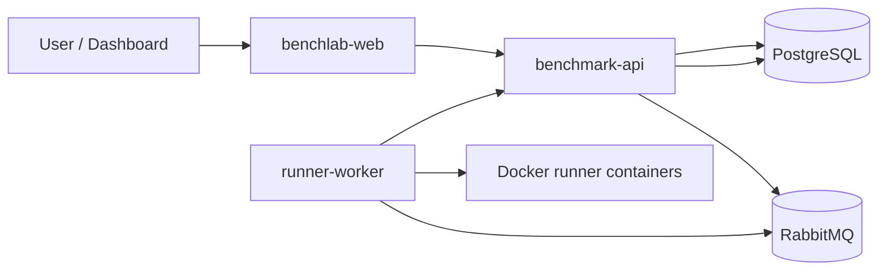

# Benchmark Platform Overview

## Components

- `benchmark-api` (Spring Boot + JHipster):
  - authentication/authorization
  - implementation and run APIs
  - enqueue run jobs to RabbitMQ
  - persist runs, metrics, and artifacts in PostgreSQL
- `runner-worker` (Go):
  - consumes run jobs from RabbitMQ queue
  - reports a run-start callback, then compiles and executes source in short-lived Docker containers
  - applies network, filesystem, timeout, CPU, and memory controls to runner containers
  - retains bounded stdout/stderr previews and posts terminal results back to the API
- `benchlab-web` (React + Vite):
  - submits quick or broad benchmark presets
  - displays queued/running/completed progress and result charts
  - polls only while work is active, pauses while the document is hidden, and prevents overlapping/stale refreshes
- PostgreSQL stores catalog, run, metric, and artifact state. Redis supports the existing application cache/session integration.
- `benchmark-api` is the Spring Boot/JHipster backend. It owns authentication, benchmark catalog data, run orchestration, RabbitMQ publishing, result persistence, and benchmark query endpoints.
- `runner-worker` is a Go worker. It consumes RabbitMQ run jobs, writes submitted source code into a temporary workspace, compiles when needed, executes Docker-isolated containers, aggregates timings, and posts results back to the API.
- `benchlab-web` is the React/Vite dashboard. It provides login, seeded benchmark templates, run configuration, recent-run tables, and interactive benchmark charts.
- PostgreSQL stores algorithms, datasets, implementations, runs, metrics, and truncated artifacts.
- RabbitMQ decouples API request handling from benchmark execution.
- Redis is used by the JHipster backend cache layer.
- Host-level Nginx terminates public traffic on the VPS and proxies `/` to the web container and `/api/**` to the API container.

## Runtime Flow

- API never executes user code directly.
- Worker owns execution lifecycle.
- Communication is asynchronous through RabbitMQ.
- Only generated OpenAPI controllers/delegates own public benchmark routes. A focused internal controller owns worker callbacks.
- Admission limits are enforced in the API before work is published.

## Backend Layers

- `web/rest/benchmark/BenchmarkResource.java` exposes benchmark HTTP endpoints under `/api`.
- `web/api/*DelegateHandler.java` maps OpenAPI-generated API delegates into service DTOs.
- `service/BenchmarkService.java` defines benchmark capabilities.
- `service/impl/BenchmarkServiceImpl.java` implements catalog creation, run creation, result registration, and benchmark aggregation queries.
- `service/messaging/RunEventPublisher.java` publishes run jobs to RabbitMQ.
- `repository/*Repository.java` owns persistence access.
- `domain/*` contains JPA entities and enums.
- `service/dto/benchmark/*` contains API/service DTOs.
- `config/BenchLabProperties.java` defines queue and worker callback-token properties.

## Metric Semantics

- `orchestrationWallTimeMs`: median wall-clock duration of measured Docker commands, including container and process startup.
- `executionWallTimeMs`: median wall-clock duration measured inside the isolated container around the benchmark process, excluding Docker container startup.
- `compileWallTimeMs`: wall-clock duration of the compile Docker command, where applicable.
- `cpuTimeMs` and `peakMemoryMb`: unavailable (`null`) because the worker does not currently collect trustworthy measurements.
- Output is a preview, not the complete stream. Each stream retains at most 8,000 bytes during execution and exposes a truncation flag.

These timings support comparative demo exploration on one host, but they are not a substitute for calibrated CPU microbenchmarks.

## Queue Reliability Boundary

The current queue/callback flow is intentionally at-least-once and has known recovery gaps. The next milestone is specified in [Queue Reliability Next Milestone](queue-reliability-next.md).

## Data Model

- `algorithm`: benchmark family and declared complexity.
- `dataset`: input size, seed, checksum, and dataset version.
- `implementation`: source code for one algorithm/language pair plus a source hash.
- `benchmark_run`: queued/executing/completed run state for one implementation and dataset.
- `run_metric`: orchestration and execution timing, memory, exit code, timeout, and compile timing.
- `run_artifact`: truncated stdout/stderr, output size, checksum, and technical summary.

## Worker Timing Model

- Compiled languages are compiled once per job before measured iterations.
- Warmup iterations and measured iterations each run in fresh Docker containers.
- `orchestrationWallTimeMs` is the median measured cold-container wall-clock time.
- `executionWallTimeMs` is the median measured in-container process wall-clock time and is the default complexity metric.
- `cpuTimeMs` is unavailable (`null`) because the worker does not currently collect a trustworthy CPU-time counter.
- The worker technical summary stores sample count, min, median, mean, and max measured wall-clock milliseconds.
- Measured iterations must produce identical stdout/stderr; non-deterministic output is treated as a runtime error.

## Supported Runner Languages

- `PYTHON`: `python:3.12-alpine`
- `JAVA`: `eclipse-temurin:21-jdk`, compiled with `javac`
- `C`: `gcc:14`, compiled with `gcc -O2`
- `GO`: `golang:1.22-alpine`, compiled with `go build -trimpath`
- `RUBY`: `ruby:3.3-alpine`
- `RUST`: `rust:1.87-bookworm`, compiled with `rustc -C opt-level=2`
- `ASSEMBLY`: `gcc:14`, compiled as GNU assembler source

## Security Boundaries

- The API does not execute submitted source code directly.
- The worker executes code in short-lived Docker containers with `--network none`, `--read-only`, `/tmp` tmpfs, memory limits, and CPU limits.
- The worker callback endpoint `POST /api/internal/runs/{id}/result` requires `X-Worker-Token`.
- Production requires `BENCHLAB_SECURITY_ADMIN_PASSWORD`; the API refuses unsafe default admin-password configuration.
- Do not commit real `.env` files, registry tokens, JWT secrets, database passwords, worker tokens, or VPS credentials.

## Deployment Shape

- GitHub Actions runs tests/Sonar, builds three images, publishes to GHCR, syncs `/deploy` to the VPS, writes a generated `.env`, and restarts Docker Compose.
- The VPS runs runtime-only containers: API, web, worker, PostgreSQL, Redis, and RabbitMQ.
- The worker container mounts `/var/run/docker.sock` and `WORKER_TEMP_PATH` so it can launch sibling runner containers.
